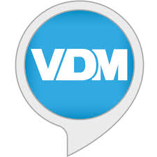

# VDM
Raconte des histoires drôles et anecdotes du site VieDeMerde.

This plugin is an add-on for the [A.V.A.T.A.R](https://avatar-home-automation.github.io/docs) framework.

🎯 Usage
Commandes :

raconte une vdm
donne moi une vdm

# Multi-room
The VDM plugin is fully multi-room.

# Multi-language
The VDM plugin relies solely on the system's available languages.

 <table style="border: none;">
  <tr>
    <td style="border: none;"></td>
    <td style="border: none;">
      <h1 style="margin: 0;color: brown;">VDM</h1>
      <h3 style="margin: 0;">Get VDM</h3>
    </td>
  </tr>
</table>
